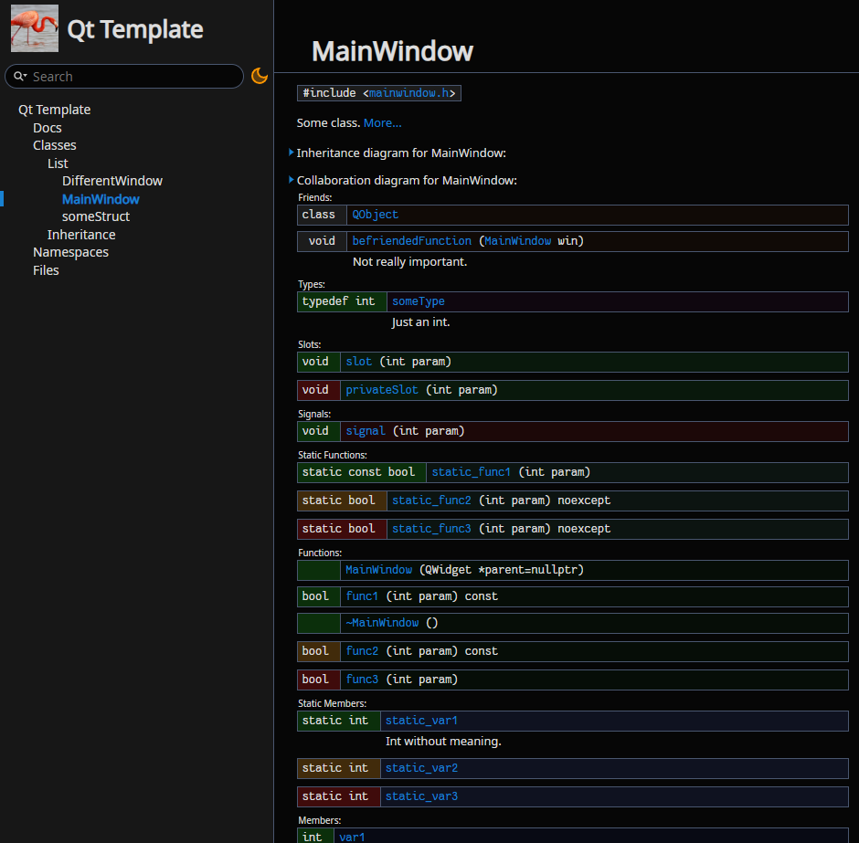
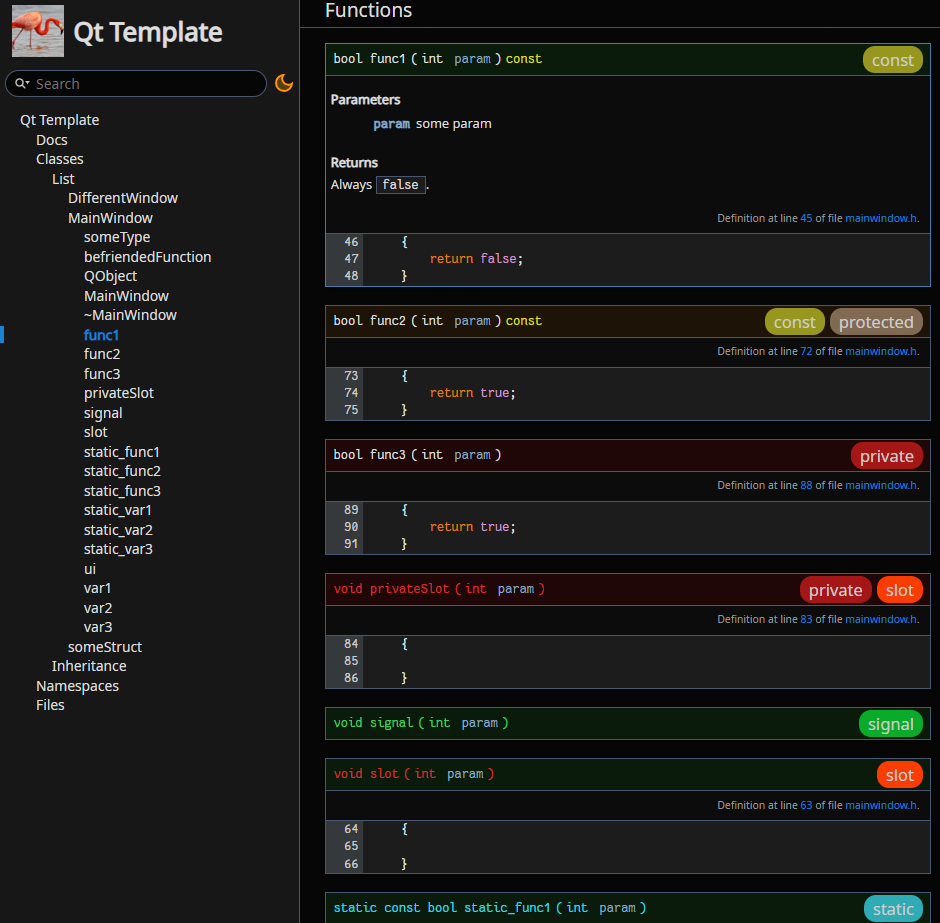
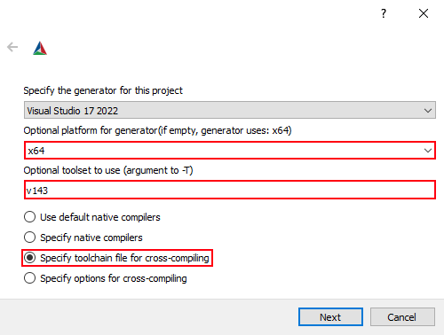

[](https://github.com/lighttab2/qt-template/actions/workflows/macos.yml)
[](https://github.com/lighttab2/qt-template/actions/workflows/windows.yml)
[](https://github.com/lighttab2/qt-template/actions/workflows/ubuntu.yml)
[](https://github.com/lighttab2/qt-template/releases)

# [Project name]
[Project logo]

[Cool PNGs to attract people]

<p align="center">


</p>

[Project short info]

[Project usage example GIFs]

## Install

<details><summary>Prerequisites</summary>

* **[CMake v3.21+](https://cmake.org/)**

* **[Python 3](https://www.python.org/)**
    * **Conan** &ndash; `pip install conan`

* **[Qt 6](https://www.qt.io/)**

* **C++ compiler that can compile Qt6** &ndash; needs to support the **C++17** standard. Lists of viable compilers:
    * [Linux](https://doc.qt.io/qt-6/linux.html)
    * [Windows](https://doc.qt.io/qt-6/windows.html)
    * [macOS](https://doc.qt.io/qt-6/macos.html)

<hr>
</details>

### Install packages using *Conan*:

```bash
conan install conan/ --build=missing --settings=build_type=Debug
conan install conan/ --build=missing --settings=build_type=Release
```

### [Simply run *CMake*:](https://cmake.org/runningcmake/)

<details><summary>Bash</summary>

```bash
cmake . -G [generator] -T [toolset] --build [PathToBuiltProject]
```

Example:

```bash
cmake . -G "Visual Studio 16 2019" -T v143 -Bbuild
```

<hr>
</details>

<details><summary>GUI</summary>

The procedure is the standard one, but there are three things to be way of.

**In-source** builds are not allowed so these directories must differ:
<p align="center">

</p>

You need to provide **architecture** and **toolkit**. If you leave them blank, project **generation** will likely fail. Also select option to specify the **toolchain file**:

<p align="center">

</p>

If you did not tinker with *Conan*, the **toolchain file** should be found at `conan/conan_toolchain.cmake`. 

<p align="center">

</p>

<hr>
</details>

### Build the project

You can use your local *IDE* or *CMake* again:

```bash
cmake --build [pathToBuiltProject] --config [configuration] -j4 -DCMAKE_TOOLCHAIN_FILE=[pathToConanToolchainFile]
```

Example:

```bash
cmake --build build --config release -j4 -DCMAKE_TOOLCHAIN_FILE=conan/conan_toolchain.cmake
```

## Features
[List of features]

## Troubleshooting

<details><summary>Need to add a new library</summary>

### Qt6 library
Simply modify `cmake/Modules.cmake`:

```cmake
set(QT_COMPONENTS Core {Other Qt6 libraries you want})
```

### Other libraries

Modify `conan/conanfile.txt`:

```ini
[requires]
{...Other libraries...}
{Your Library Name Here Taken From https://conan.io/center/}

[generators]
CMakeDeps
CMakeToolchain
```

Example:

```ini
[requires]
zlib/1.2.11
libcurl

[generators]
CMakeDeps
CMakeToolchain
```

Remember to run *Conan* after the changes:

```bash
conan install conan/ --build=missing --settings=build_type=Debug
conan install conan/ --build=missing --settings=build_type=Release
```

If the library cannot be found on *ConanCenter*, you could try going for [Artifactory](https://docs.conan.io/2/), but this requires some effort. You can always use plain *CMake* and modify `CMakeLists.txt`, [ChatGPT](https://chat.openai.com/) might help with such quick fixes.

Now the library should be available but not added to the *CMake* project itself. Check if the library has **components**. Libraries with **components** are libraries like *Qt6* or *Boost*, in which you can choose to use a few of their all features. Because of technical reasons, the **header-only** libraries should also be added as "libraries with components".

<ul style="list-style-type:none;">
<li><details><summary>Library w/o components</summary>

Modify `cmake/Modules.cmake`:

```cmake
set(MODULES {Libraries})
```

Example:

```cmake
set(MODULES ZLIB libcurl)
```

That's it!
<hr>
</details>

<details><summary>Header-only library</summary>

Modify `cmake/Modules.cmake`:

```cmake
set(MODULES_WITH_COMPONENTS Qt6 {libraries with components} {header-only libraries})
```

Example:

```cmake
set(MODULES_WITH_COMPONENTS Qt6 imgui)
```

That's it!

<hr>
</details>
</li>

<li><details><summary>Library with components</summary>

Modify `cmake/Modules.cmake`:

```cmake
set(MODULES_WITH_COMPONENTS Qt6 {libraries with components} {header-only libraries})
set({NEW_VARIABLE_WITH_COMPONENTS} {COMPONENTS})
```

Example:

```cmake
set(MODULES_WITH_COMPONENTS Qt6 Boost)
set(BOOST_COMPONENTS filesystem)
```

Modify `CMakeLists.txt` and after `include(cmake/Modules.cmake)` add following code:

```cmake
foreach(library IN LISTS {NEW_VARIABLE_WITH_COMPONENTS})
    find_package({LIBRARY_NAME} COMPONENTS ${library} REQUIRED)
endforeach()
```

Example:

```cmake
foreach(library IN LISTS BOOST_COMPONENTS)
    find_package(Boost COMPONENTS ${library} REQUIRED)
endforeach()
```

In the **same file**, after `# Link libraries` add following code:

```cmake
foreach(library IN LISTS {NEW_VARIABLE_WITH_COMPONENTS})
    target_link_libraries(${PROJECT_NAME} PRIVATE {LIBRARY_NAME}::${library})
    if(${PROJECT_NAME}_BUILD_EXECUTABLE)
        target_link_libraries(${PROJECT_NAME}_LIB PRIVATE {LIBRARY_NAME}::${library})
    endif()
endforeach()
```

Example:

```cmake
foreach(library IN LISTS BOOST_COMPONENTS)
    target_link_libraries(${PROJECT_NAME} PRIVATE Boost::${library})
    if(${PROJECT_NAME}_BUILD_EXECUTABLE)
        target_link_libraries(${PROJECT_NAME}_LIB PRIVATE Boost::${library})
    endif()
endforeach()
```

You should also link the library to the **test** projects. To do that, modify `test/CMakeLists.txt` and after `# Link libraries` add following code:

```cmake
    foreach(library IN LISTS {NEW_VARIABLE_WITH_COMPONENTS})
        target_link_libraries(${test_name}_Tests PRIVATE {LIBRARY_NAME}::${library})
    endforeach()
```

Example:

```cmake
    foreach(library IN LISTS BOOST_COMPONENTS)
        target_link_libraries(${test_name}_Tests PRIVATE Boost::${library})
    endforeach()
```

<hr>
</details>
</li>
</ul>
<hr>
</details>

<details><summary><i>Qt6</i> is not found, despite being installed</summary>

Ensure that these **environment variables** are set properly:

* **Qt6_DIR** - `[path_to_Qt]/[version]/[compiler]/lib/cmake/Qt6`<br/>Example: `C:/Qt/6.5.1/msvc2019_64/lib/cmake/Qt6`

* **Qt6GuiTools_DIR** - `[path_to_Qt]/[version]/[compiler]/lib/cmake/Qt6GuiTools`<br/>Example: `/usr/lib/x86_64-linux-gnu/6.5.1/clang_64/lib/cmake/Qt6GuiTools`

* **Qt6CoreTools_DIR** - `[path_to_Qt]/[version]/[compiler]/lib/cmake/Qt6CoreTools`<br/>Example: `D:/Qt/6.3/msvc2019_64/lib/cmake/Qt6CoreTools`

<hr>
</details>

<details><summary>Missing or wrong libraries | Profile errors</summary>

Ensure `conan/conanfile.txt` has listed all the needed libraries under `[requires]` section.
Run:

```bash
conan install conan/ --build=missing --settings=build_type=Debug
conan install conan/ --build=missing --settings=build_type=Release
```

In case of a **wrong architecture** of the libraries and other possible **profile errors**, read: [https://docs.conan.io/2.0/reference/config_files/profiles.html](https://docs.conan.io/2.0/reference/config_files/profiles.html)<br/>
If you don't have a profile, create one:

```bash
conan profile new default --detect
```

<hr>
</details>

<details><summary>Changing the name of the project</summary>

To change the name of the project, you must correct a few entries:
 
<ul style="list-style-type:none;">
<li><details><summary><code>CMakeLists.txt</code></summary>
By default, the file starts with:

```cmake
cmake_minimum_required(VERSION 3.21)

project("qt-template"
        LANGUAGES CXX)
```

Change `"qt-template"` to the name of your project.
        
Example:

```cmake
cmake_minimum_required(VERSION 3.21)

project("myproject"
        LANGUAGES CXX)
```
    
If you host your project on a *GitHub* repository and wish to use *GitHub Actions* for automatic deployment, you must provide a name that matches the **repository name**. It has to be **lowercase**. Otherwise, you need to change `${{ steps.repoName.outputs.name }}` to your **project's executable/library name** (it is the **CMake project name**, unless you tinkered with `CMakeLists.txt`) in these files:
* `.github/workflows/macos.yml`
* `.github/workflows/ubuntu.yml`
* `.github/workflows/windows.yml`

If the name contains *whitespace characters*, you will need to enclose the entire entry in either `"` or `'`. Example:

```yaml
files: build/install/${{ steps.repoName.outputs.name }}_macOS_${{ steps.versionTag.outputs.tag }}.tar.gz
```

Becomes:

```yaml
files: "build/install/Parrots and Cats_macOS_${{ steps.versionTag.outputs.tag }}.tar.gz"
```

<hr>
</details>
</li>

<li><details><summary><code>config.desktop</code></summary>

The `Exec` option should contain the **project's executable/library name** (it is **CMake project name**, unless you tinkered with `CMakeLists.txt`), while the `Name` is up to your choice. 

Change these entries:

```ini
Name=Qt Template
Exec=qt-template
```

Example:

```ini
Name=Parrots That Sing
Exec=birds-and-stuff
```

<hr>
</details>
</li>
</ul>
<hr>
</details>

<details><summary>Changing the icon of the project</summary>

Put your **icon image** in **PNG** format into a folder `icon/` and **rename** it, so it matches this convention:

```ini
icon_[width]x[height].png
```

Example:

```
icon_256x256.png
```

The resolution should be one of these:
* 16x16
* 32x32
* 48x48
* 64x64
* 128x128
* 256x256

Further below, I will mention some *scripts* that use [ImageMagick](https://imagemagick.org/index.php), so you need to install it, if you want to use them. On *Ubuntu*, it can be done by:
```bash
sudo apt install imagemagick
```

Beware that depending on your **OS version**, you can get either *ImageMagick 6* or *ImageMagick 7*. *Unix scripts* contain `[script]_ImageMagick7.sh` versions, in case you did not obtain *ImageMagick 6*, but *ImageMagick 7*.

You can provide an icon with **any** resolution, and it will be **rescaled** to the other **valid resolutions**, if you use the script:
<ul style="list-style-type:none;">
<li><details><summary>Windows</summary><code>/icon/WinScripts/rescale.bat</code></details></li>
<li><details><summary>Unix</summary><code>/icon/UnixScripts/rescale.sh</code> or <code>/icon/UnixScripts/rescale_ImageMagick7.sh</code> </details></li>
</ul>

If there are multiple icons with **different resolutions**, the **highest resolution** will be used to create other **valid** icons. They will **overwrite** any already existing ones! If you want to use **different icons** for **different resolutions**, provide them manually and do not use the script.

This is sufficient for *Linux*, but there are two other scripts, so the *Windows* and *macOS* applications will have icons too.

To generate an icon for *Windows*, use:
<ul style="list-style-type:none;">
<li><details><summary>Windows</summary><code>/icon/WinScripts/createIco.bat</code></details></li>
<li><details><summary>Unix</summary><code>/icon/UnixScripts/createIco.sh</code> or <code>/icon/UnixScripts/createIco_ImageMagick7.sh</code></details></li>
</ul>

*macOS* icon is slightly tricky on *Windows*, as we do not have a ready script. I recommend using [WSL](https://learn.microsoft.com/en-us/windows/wsl/install) or another form of virtualization (i.e.: [VirtualBox](https://www.virtualbox.org/) or [Docker](https://www.docker.com/)) and running the *Unix script* `/icon/UnixScripts/createIcns.sh`.\
If you are on *macOS*, you can do this the **native way**, using [iconutil](https://stackoverflow.com/questions/12306223/how-to-manually-create-icns-files-using-iconutil). Otherwise, run `/icon/UnixScripts/createIcns.sh`, which requires `png2icns` library. On *Ubuntu* you can install it by:

```bash
sudo apt install icnsutils
```
    
<hr>
</details>

<details><summary>Docs shouldn't contain private members</summary>

If your project is a library, you might not want to add the private and protected members to your documentation. Editing one line in `.github/workflows/doxygen.yml` can change this behaviour. Find this step:

```yaml
- name: Generate documents and deploy
    uses: DenverCoder1/doxygen-github-pages-action@v1.3.0
    with:
        github_token: ${{ secrets.GITHUB_TOKEN }}
        branch: docs
        config_file: doxygen/Doxyfile_dev
```

And change it to:

```yaml
- name: Generate documents and deploy
    uses: DenverCoder1/doxygen-github-pages-action@v1.3.0
    with:
        github_token: ${{ secrets.GITHUB_TOKEN }}
        branch: docs
        config_file: doxygen/Doxyfile
```

 If you want to further customize output and its display, all files related to documentation are stored in `/doxygen` folder. 

<hr>
</details>

## Contributing

This project follows these [C++ Core Guidelines](https://isocpp.github.io/CppCoreGuidelines/CppCoreGuidelines), and it would be fun if you followed them too. If you don't, someone will correct your code. An ugly contribution is better than no contribution. **Thanks**!

## License

This project is licensed under the [CC0 1.0 Universal](https://creativecommons.org/publicdomain/zero/1.0/); see the
[LICENSE](LICENSE) file for details.
It also uses the [Qt](https://www.qt.io/) library and possibly some of its additional modules that are licensed under the [LGPL](https://www.gnu.org/licenses/lgpl-3.0.en.html), but **none** of its code is present in this repository. Also note that *Qt* itself uses [other third-party libraries](https://doc.qt.io/qt-6/licenses-used-in-qt.html) under **different** license terms.
