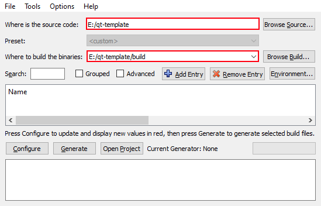

[TOC]

# Doxygen Capability Test Page {#test_page}

This page exercises the Doxygen feature surface so the theme, MathJax/formula
pipeline, Graphviz (`HAVE_DOT`), and Markdown extensions can all be verified in
one render. If something breaks, it breaks visibly here.

@note This is a `\page` (anchor `test_page`). It shows up in the tree because
`GENERATE_TREEVIEW = YES`. Headings up to level 5 populate the `[TOC]` block
(`TOC_INCLUDE_HEADINGS = 5`).

---

## 1. Text formatting

*Italic*, **bold**, ***bold italic***, `inline code`, ~~strikethrough~~,
H<sub>2</sub>O, E = mc<sup>2</sup>, and a hard line break follows here\
this sits on the next line.

Special command spellings still work: @a italic, @b bold, @c typewriter.

> Block quote, first level.
>
> > Nested block quote, second level, with `code` inside.

---

## 2. Lists

### 2.1 Unordered, nested

- Level one item
  - Level two item
    - Level three item with **bold**
- Back to level one

### 2.2 Ordered

1. First
2. Second
   1. Nested first
   2. Nested second
3. Third

### 2.3 Task list (checkbox extension)

- [x] Render this page
- [x] Exercise Graphviz
- [ ] Find a rendering bug
- [ ] File it upstream

### 2.4 Definition list

Qt6
: Cross-platform C++ framework used by this template.

Conan
: The dependency manager providing Boost and ms-gsl.

---

## 3. Tables

| Feature            | Command / Syntax        | Requires    | Status |
| :----------------- | :---------------------- | :---------: | -----: |
| Formula            | `@f$ ... @f$`           | LaTeX       |   left |
| Call graph         | `@dot` / `HAVE_DOT`     | Graphviz    | center |
| Sequence chart     | `@msc`                  | mscgen      |  right |
| Cross reference    | `#Symbol` / `@ref`      | index       |    yes |

Column alignment above is set by the `:` markers in the separator row.

---

## 4. Code blocks

### 4.1 Fenced with language (C++)

```cpp
#include <gsl/gsl>
#include <QApplication>

/// Entry point kept minimal for the doc render test.
int main(int argc, char* argv[]) {
    gsl::span<char*> args{argv, gsl::narrow_cast<std::size_t>(argc)};
    QApplication app(argc, argv);
    return app.exec();
}
```

### 4.2 Doxygen `@code` block

@code{.cpp}
auto x = std::make_unique<int>(42);
@endcode

### 4.3 Shell

```bash
cmake . -G Ninja -B build -DCMAKE_TOOLCHAIN_FILE=conan/conan_toolchain.cmake
cmake --build build --config Release
```

---

## 5. Formulas (LaTeX)

Inline: the mass-energy relation @f$ E = mc^2 @f$ sits in running text.

Block:

@f[
    \int_{-\infty}^{\infty} e^{-x^2}\,dx = \sqrt{\pi}
@f]

Matrix environment:

@f[
    A =
    \begin{pmatrix}
        a_{11} & a_{12} \\
        a_{21} & a_{22}
    \end{pmatrix}
@f]

@warning Formulas depend on the LaTeX toolchain (`HTML_FORMULA_FORMAT = png`,
`USE_MATHJAX = NO`). Missing `latex`/`dvips`/`gs` makes these render as broken
image placeholders - a good canary for the docs environment.

---

## 6. Graphviz diagrams (`HAVE_DOT = YES`)

### 6.1 Inline `@dot` graph

@dot "Build target dependency"
digraph targets {
    rankdir=LR;
    node [shape=box, style=rounded];
    sources   -> "qt6-template"       [label="app"];
    sources   -> "qt6-template_LIB"   [label="lib"];
    "qt6-template_LIB" -> tests        [label="linked by"];
    Conan     -> sources               [label="boost, ms-gsl"];
    Qt6       -> sources               [label="find_package"];
}
@enddot

### 6.2 Message sequence chart (`@msc`)

@msc
    App, Library, Test;
    Test  => Library [label="call API"];
    Library => App   [label="emit signal"];
    App -> Test      [label="assert result"];
@endmsc

---

## 7. Cross references and links

- External link: [Qt documentation](https://doc.qt.io/qt-6/).
- Autolink: <https://www.doxygen.nl/>.
- Section reference: jump to @ref test_page "the top of this page".
- Symbol reference (resolves if the class is documented): #QException.

@see The project @ref index "main page" for the overview.

---

## 8. Admonitions and paragraph commands

@note A note callout.
@tip Prefer `make build` over raw cmake for local work.
@warning A warning callout.
@attention An attention callout.
@remark A side remark.
@todo A tracked to-do item (aggregates on the Todo list page).
@bug A known bug entry (aggregates on the Bug list page).
@deprecated Marks something on its way out.

---

## 9. Images

The `IMAGE_PATH` is `pages`, so bare filenames resolve:



@image html doxygen_dark.png "Dark-mode theme via @image html" width=480px

---

## 10. Footnotes and horizontal rules

Doxygen supports footnotes[^note] in Markdown.

[^note]: This is the footnote body; it renders at the bottom of the page.

Three consecutive ways to draw a rule (`---`, `***`, `___`):

***

## 11. Emoji and entities

Emoji shortcodes: :rocket: :warning: :white_check_mark: :bug:

HTML entities: &copy; &mdash; &rarr; &alpha; &beta; &le; &ge; &ne;

---

@par Final note
If every section above renders correctly - typography, tables, syntax-highlighted
code, PNG formulas, Graphviz SVG (`DOT_IMAGE_FORMAT = svg`), the sequence chart,
callouts, images, and footnotes - the Doxygen pipeline and theme are healthy.
